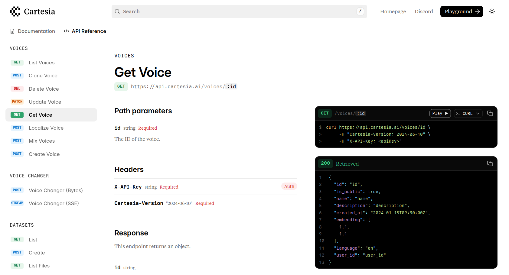

The vast majority of real-world APIs use the REST protocol. Very little configuration is needed to configure Fern to generate REST API documentation.

## Configuration

1. Create an [OpenAPI Specification](/learn/api-definition/openapi/overview) or [Fern Definition](/learn/api-definition/fern/overview).
1. Add an [API Reference entry](/learn/docs/api-references/generate-api-ref) to `docs.yml`.
1. Set any additional [configuration options](/learn/docs/api-references/generate-api-ref#api-reference-configuration-options) in `docs.yaml`.

See the [Cartesia](https://github.com/cartesia-ai/docs) GitHub repo for an example of Fern configuration for REST API documentation.

<a href="https://docs.cartesia.ai/api-reference/voices/get">
    <Frame caption="Example of Fern rendering REST API Reference documentation">
        
    </Frame>
</a>
